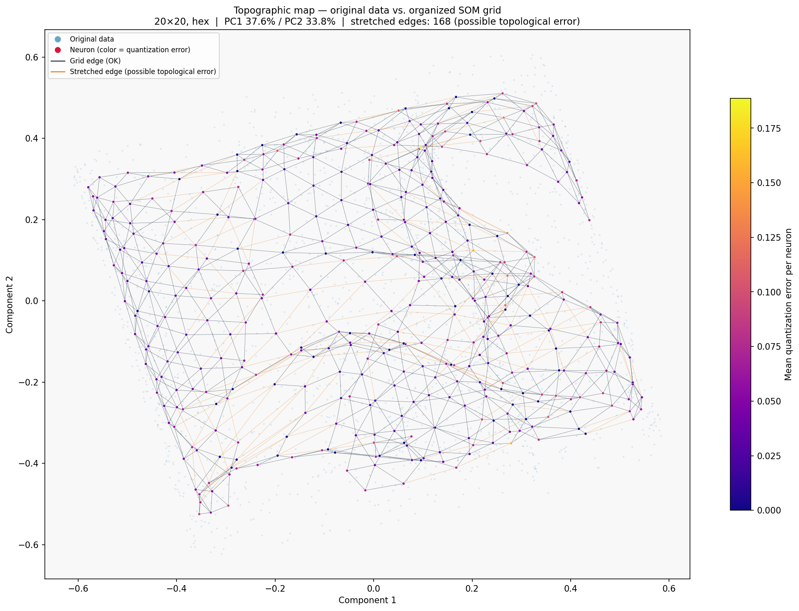

# NexusMap – Data analysis and visualization with Kohonen maps

NexusMap trains a Kohonen self-organizing map (SOM) on a CSV file, detects extremes, and generates JSON results and visualizations. Everything runs locally from the command line.

## 📁 Project structure

| File | Description |
|------|-------------|
| `main.py` | Command-line entry point |
| `project_processor.py` | Processing pipeline: configuration, preprocessing, SOM training, clusters, extremes, outputs |
| `kohonen.py` | Kohonen SOM implementation (square/hex grid, decay schedules, batch modes, early stopping) |
| `preprocess.py` | Input validation, column type detection, encoding, scaling to [0,1] |
| `visualization.py` | Map generation (U-matrix, hit map, component planes, pie maps, topology maps, …) |
| `utils.py` | Logging to the output directory |
| `config/requirements.txt` | Python dependencies |
| `config/default-config.json` | Configuration template with default SOM settings |
| `plot_som_topology.py` | Standalone CLI for plotting the SOM grid in a projected space (PCA/UMAP/t-SNE/ISOMAP) |
| `krivky.py` | Standalone script plotting the decay/growth curves used for training parameters |
| `evolutionary_analyse/` | Evolutionary optimization of SOM parameters – see [its README](evolutionary_analyse/README.md) |
| `examples/` | Example runs with data, configuration and generated outputs – see [its README](examples/README.md) |

## 🛠️ Installation

Requires Python 3.10+.

```bash
python3 -m venv .venv
source .venv/bin/activate
pip install -r config/requirements.txt
```

Optional packages for `plot_som_topology.py`: `plotly` (HTML output) and `umap-learn` (UMAP projection).

## 🚀 Usage

```bash
python3 main.py --input data.csv --config config.json --output results/
```

| Argument | Description |
|----------|-------------|
| `-i`, `--input` | Input CSV file (comma-separated) |
| `-c`, `--config` | JSON configuration with `project_settings` and `som_settings` (see below) |
| `-o`, `--output` | Output directory, created if missing |

### Processing pipeline

1. Load the configuration and validate the input – all `selected_columns` must be present
2. Copy the input to `{output}/csv/input.csv`
3. Preprocess the data (`preprocess.py`) and save `csv/preprocess-input.csv`
4. Train the SOM and save the metrics to `json/results.json`
5. Assign samples to neurons (clusters) and generate pie chart data for categorical columns
6. Compute per-group statistics and detect extremes
7. Generate the visualizations

## 🧪 Examples

[`examples/`](examples/README.md) contains a complete run on a 3D Swiss roll – input data, configuration, metrics, the generated maps and a rotatable 3D topographic map.

```bash
python3 main.py -i examples/swiss_roll/swiss_roll.csv -c examples/swiss_roll/config.json -o results/swiss_roll/
```



## 🔧 Configuration

The configuration file has two sections. Start from `config/default-config.json` – replace the placeholder columns in `project_settings` with your own; `som_settings` hold the defaults from `kohonen.py` (20×20 grid, fixed seed).

```json
{
    "project_settings": {
        "selected_columns": ["Id", "SepalLengthCm", "SepalWidthCm", "PetalLengthCm", "PetalWidthCm", "Species"],
        "primary_id": "Id",
        "segmentation_column": "Species",
        "std_threshold": 2,
        "nan_replacement": {"SepalLengthCm": 0}
    },
    "som_settings": {
        "m": 20,
        "n": 20,
        "map_type": "hex",
        "learning_rate": 0.9,
        "min_learning_rate": 0.1,
        "radius": 10.0,
        "min_radius": 1.0,
        "processing_type": "hybrid",
        "num_batches": 10,
        "min_batch_percent": 0.2,
        "max_batch_percent": 5.0,
        "lr_decay_type": "exp-drop",
        "radius_decay_type": "exp-drop",
        "batch_growth_type": "exp-growth",
        "growth_g": 15.0,
        "epoch_multiplier": 1.0,
        "random_seed": 42,
        "normalize_weights_flag": false,
        "min_q_error": null,
        "max_epochs_without_improvement": null
    }
}
```

### Project settings (`project_settings`)

| Parameter | Description | Required |
|-----------|-------------|----------|
| `selected_columns` | Columns used for the analysis | yes |
| `primary_id` | Record identifier column | yes |
| `segmentation_column` | Column used to group data for statistics and extreme detection; if empty, the first categorical column is used | yes (may be `""`) |
| `std_threshold` | Extreme detection threshold as a multiple of the standard deviation (default `2`) | no |
| `nan_replacement` | Replacement values for missing data per column | no |

Preprocessing adds the detected column types (`categorical_column`, `numerical_column`, `string_column`, `categorical_groups`). The complete settings are saved to `json/project_settings.json`.

### SOM settings (`som_settings`)

The section is passed directly to `KohonenSOM`. `m` and `n` are required; every other parameter falls back to the default from `kohonen.py`.

| Parameter | Description | Default |
|-----------|-------------|---------|
| `m`, `n` | Grid height and width | required |
| `learning_rate` | Initial learning rate | `0.9` |
| `min_learning_rate` | Final learning rate | `0.1` |
| `radius` | Initial neighborhood radius | `max(m, n) / 2` |
| `min_radius` | Final neighborhood radius | `0.1` |
| `processing_type` | `"deterministic"` (all samples per epoch), `"stochastic"` (one random sample per epoch), `"hybrid"` (growing batch) | `"hybrid"` |
| `num_batches` | Number of batches per epoch (hybrid mode) | `10` |
| `min_batch_percent` | Initial batch size in % of samples (hybrid mode) | `0.1` |
| `max_batch_percent` | Final batch size in % of samples (hybrid mode) | `5` |
| `lr_decay_type` | Learning rate schedule | `"exp-drop"` |
| `radius_decay_type` | Radius schedule | `"exp-drop"` |
| `batch_growth_type` | Batch size schedule | `"exp-growth"` |
| `growth_g` | Steepness of the exp/log schedules | `15.0` |
| `epoch_multiplier` | Number of epochs = number of samples × multiplier | `1.0` |
| `map_type` | Grid type: `"square"` or `"hex"` | `"hex"` |
| `random_seed` | Seed for reproducible results | `null` |
| `normalize_weights_flag` | Normalize weights to unit length after each epoch | `false` |
| `min_q_error` | Stop training once MQE reaches this value | `null` |
| `max_epochs_without_improvement` | Stop after this many MQE evaluations without improvement | `null` |

Available schedule types (`kohonen.py`, `get_decay_value`):

- Drop: `static`, `linear-drop`, `exp-drop`, `log-drop`, `step-down`
- Growth: `linear-growth`, `exp-growth`, `log-growth`

`krivky.py` plots these curves for different `growth_g` values.

## 🔄 Preprocessing

Column types are detected automatically:

| Condition | Type | Encoding |
|-----------|------|----------|
| Name starts with `id_` or ends with `_id` | categorical | label encoding |
| Numeric, ≤ 30 unique values | categorical | label encoding |
| Numeric, > 30 unique values | numerical | value (NaN → `nan_replacement` or 0) |
| Text, ≤ 30 unique values | categorical | label encoding, grouped by name prefix (`prefix_*`) |
| Text, > 30 unique values | text | label encoding |

The `primary_id` column only identifies records and is not used for training. Missing values are first replaced according to `nan_replacement`. All remaining selected columns are then scaled to [0,1] with `MinMaxScaler`.

## 📊 Outputs

```
{output}/
├── csv/
│   ├── input.csv                     # copy of the input data
│   ├── preprocess-input.csv          # normalized data with header
│   └── data.csv                      # normalized data used for training
├── json/
│   ├── results.json                  # training metrics
│   ├── project_settings.json         # settings including detected column types
│   ├── clusters.json                 # {"i_j": [primary IDs of samples in neuron i,j]}
│   ├── extremes.json                 # extremes by group and by cluster
│   ├── quantization_error.json       # total and per-neuron quantization error
│   ├── pie_data_{column}.json        # category counts per cluster
│   └── temp_pie_data_{group}.json    # merged data for categorical column groups
├── visualization/
│   ├── u-matrix.png
│   ├── hit.png
│   ├── component_{column}.png        # one per dimension (except primary_id)
│   ├── cluster.png
│   ├── distance.png                  # mean quantization error per neuron
│   ├── mqe-history.png
│   ├── parameters-history.png
│   ├── pie-map_{column}.png
│   ├── pie_map_group_{group}.png
│   ├── topology.png                  # PCA projection of data + SOM grid
│   ├── topology_interactive.html     # interactive 2D version (Plotly via CDN)
│   ├── topology_interactive_3d.html  # rotatable 3D version (needs ≥ 3 dimensions)
│   └── legends/                      # separate legend for each map
├── weights.npy                       # trained SOM weights (m × n × dim)
└── kohonen-log.txt                   # processing log
```

`json/results.json`:

```json
{
    "duration": 12.3,
    "total_weight_updates": 150000,
    "best_mqe": 0.0421,
    "epochs": 150,
    "map_size": [20, 20],
    "map_type": "hex",
    "max_memory_mb": 5120
}
```

## 📝 Logging

`utils.log_message` appends messages with a timestamp to `{output}/kohonen-log.txt`. During training the log gets a progress line every 500 epochs:

```
epoch|samples|batch_size|radius|learning_rate|MQE (time: h:mm:ss)
```

## 🧰 Standalone tools

### `plot_som_topology.py`

Plots the SOM weight grid together with the training data in a projected space and highlights stretched edges (possible topological errors). It reads a NexusMap output directory directly (`weights.npy`, `csv/data.csv`, `json/results.json`); sample-to-neuron assignments are computed from the weights.

```bash
python3 plot_som_topology.py results/
python3 plot_som_topology.py results/ --projection isomap
python3 plot_som_topology.py results/ --compare
python3 plot_som_topology.py results/ --all
```

Plots are saved to the results directory. Run `python3 plot_som_topology.py --help` for all options.

### `krivky.py`

```bash
python3 krivky.py
```

Writes `krivka_*.png` plots of the training schedules to the current directory.

### Evolutionary optimization

`evolutionary_analyse/evolutionary_som.py` searches for SOM parameters that minimize quantization error and computation time:

```bash
python3 evolutionary_analyse/evolutionary_som.py --input data.csv --config evolutionary_analyse/evolution-config.json
```

See [evolutionary_analyse/README.md](evolutionary_analyse/README.md) for details.

## 🚧 TODO

- [ ] Ablation study – measure the effect of individual SOM settings (decay schedules, `growth_g`, processing type, grid type, …) on quantization error and topology preservation
- [ ] Continue training from a saved state
- [ ] Unit tests
- [ ] Performance optimization for large datasets (weight updates and BMU search are partly non-vectorized)


python3 main.py --input ./var/swiss_roll.csv  --output ./var/results/
