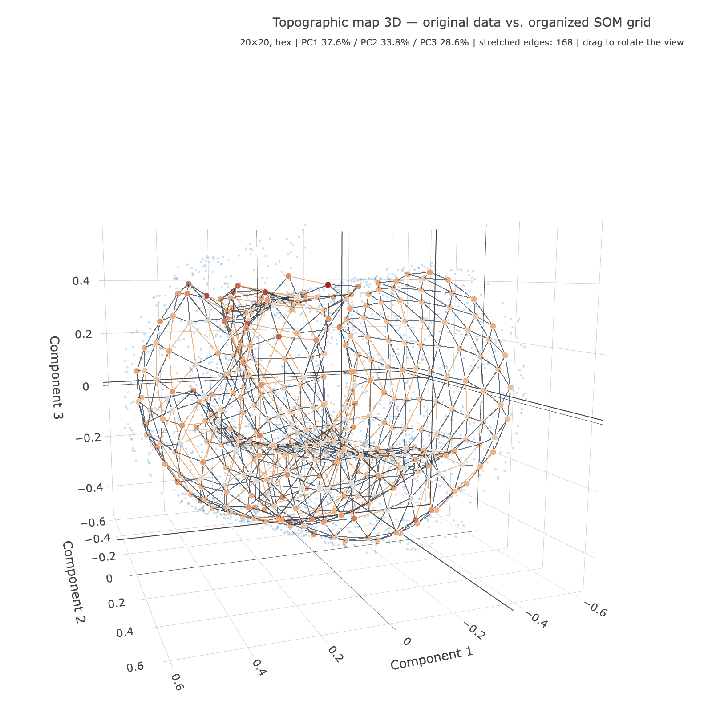
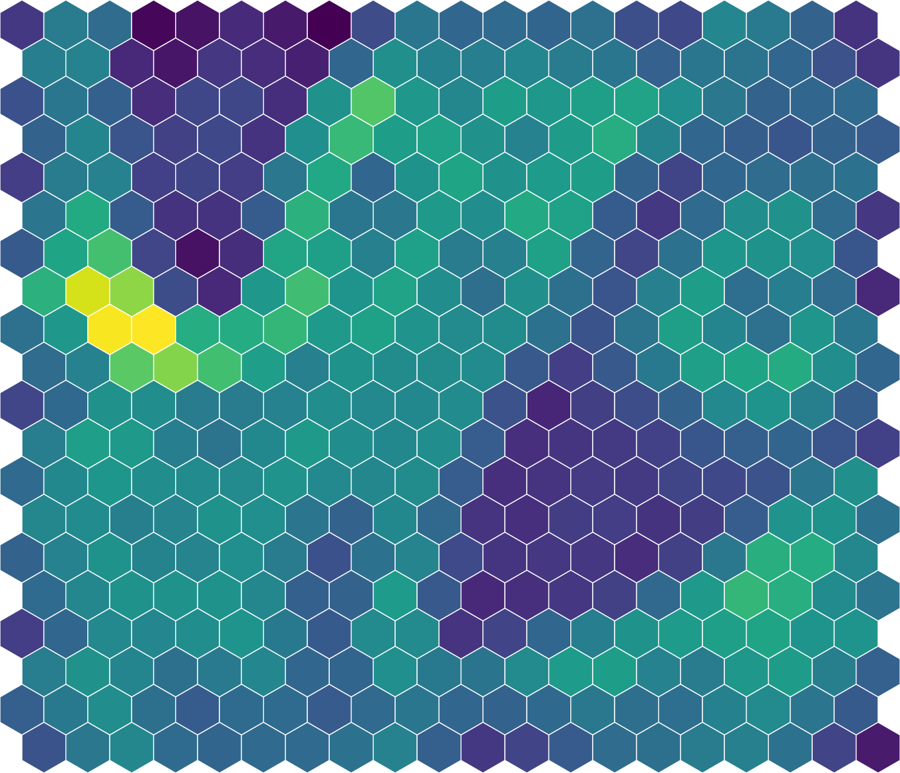
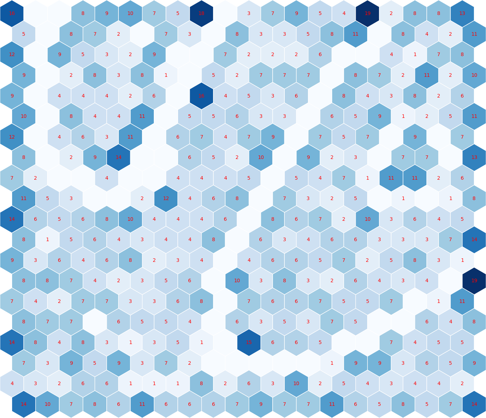
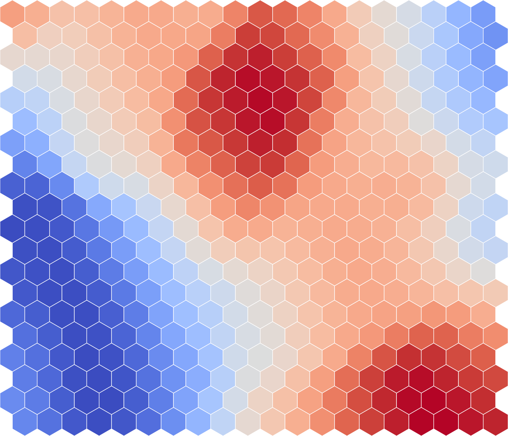
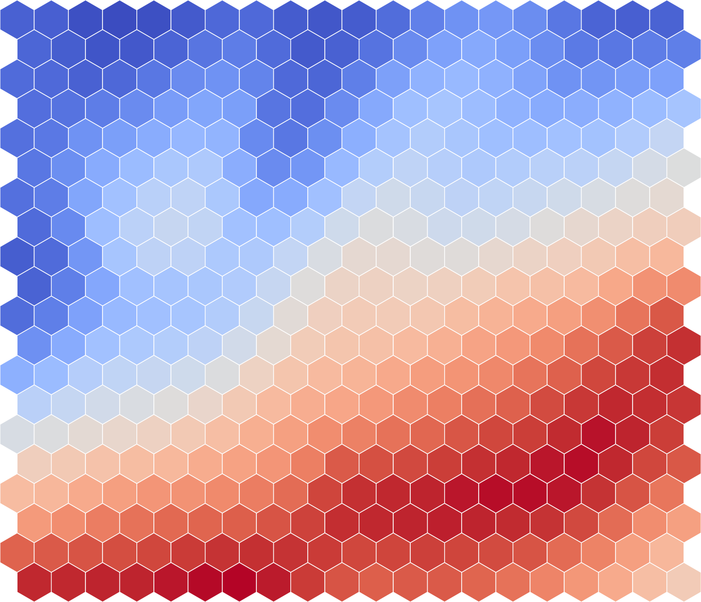
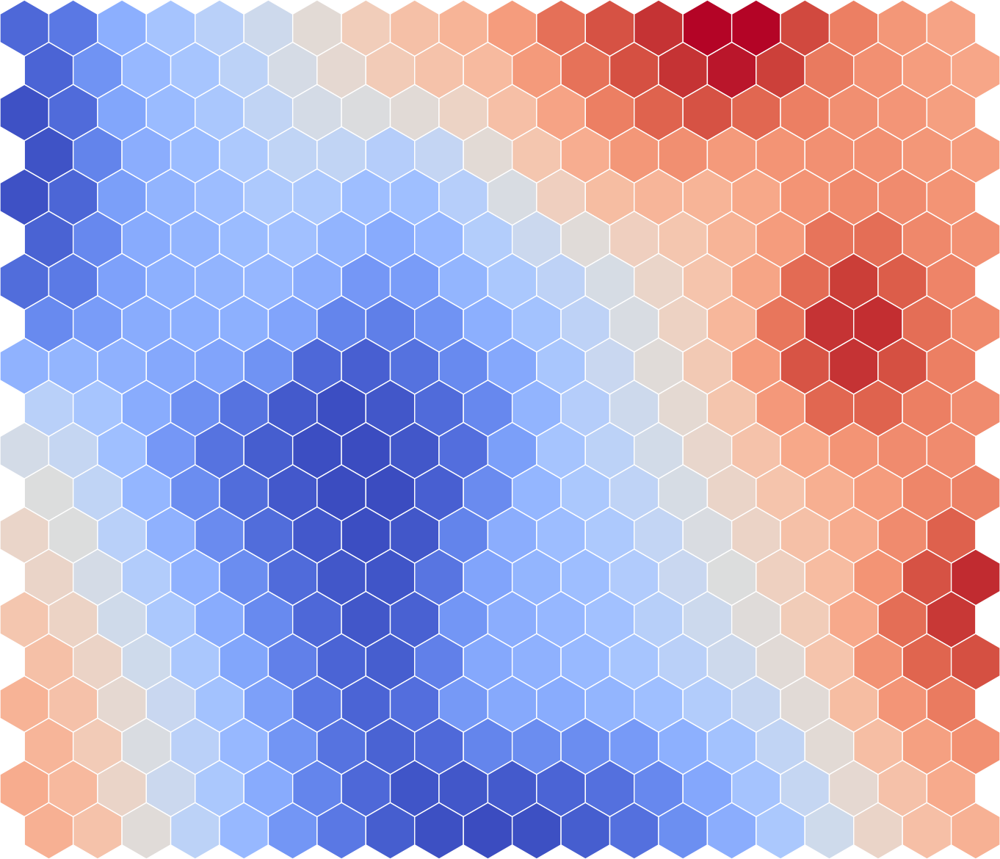
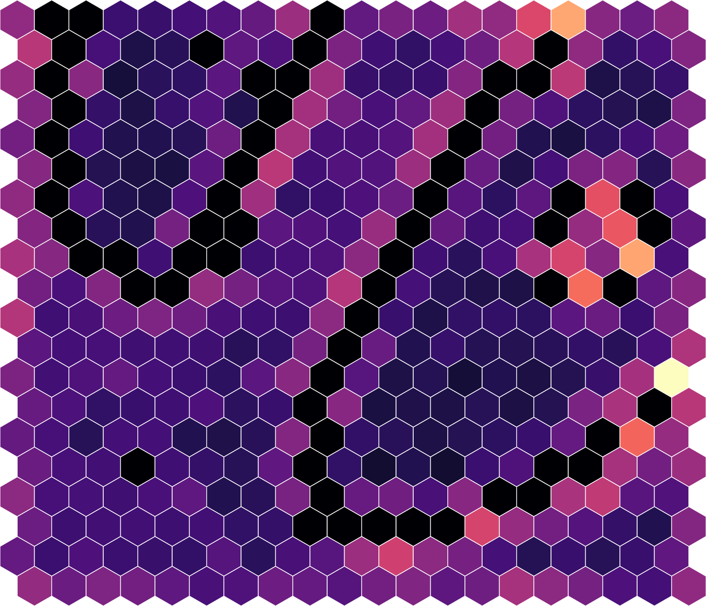
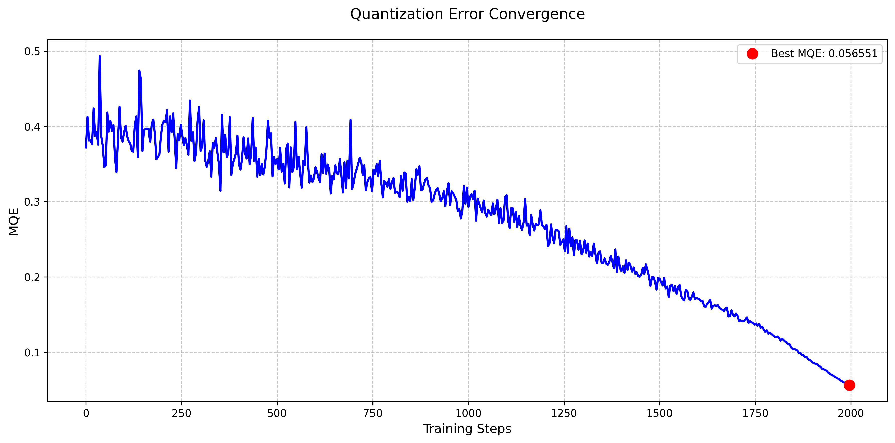
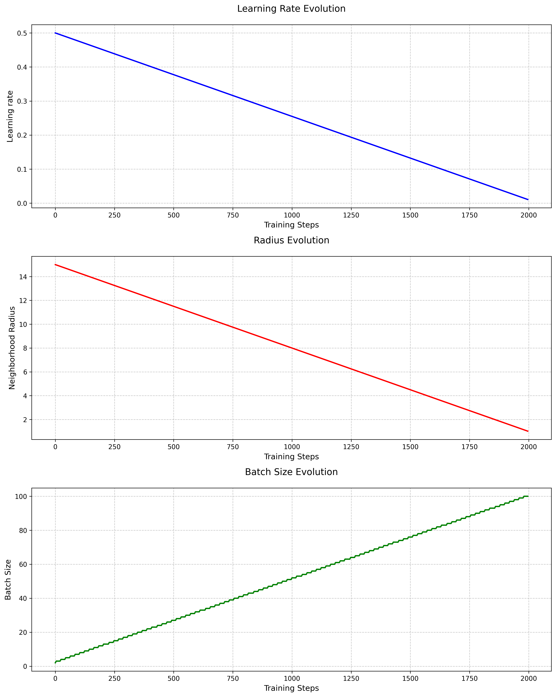

# Examples

## Swiss roll

A 3D Swiss roll (2,000 points) is a classic test of topology preservation: the data lie on a rolled-up 2D sheet, so a good SOM should unroll it without connecting neighboring turns of the roll.

| File | Description |
|------|-------------|
| [`swiss_roll/swiss_roll.csv`](swiss_roll/swiss_roll.csv) | Input data – columns `id`, `x`, `y`, `z` |
| [`swiss_roll/config.json`](swiss_roll/config.json) | Configuration used for the run |
| [`swiss_roll/results.json`](swiss_roll/results.json) | Training metrics |
| [`swiss_roll/topology_interactive_3d.html`](swiss_roll/topology_interactive_3d.html) | Rotatable 3D topographic map (open in a browser; loads Plotly from a CDN) |
| [`swiss_roll/images/`](swiss_roll/images/) | Generated maps and a screenshot of the 3D map (`topology2.png`) |

Reproduce from the project root:

```bash
python3 main.py -i examples/swiss_roll/swiss_roll.csv -c examples/swiss_roll/config.json -o results/swiss_roll/
```

### Settings

- 20×20 hex grid, `hybrid` processing, `epoch_multiplier` 1 (2,000 epochs), seed 42
- Learning rate 0.5 → 0.01 and radius 15 → 1, both `linear-drop`, so the map has time to organize globally before fine-tuning
- `id` is the primary ID and is not used for training; `x`, `y` and `z` are numerical columns
- No categorical column, so there are no pie maps and extremes by group are empty

### Results

| Metric | Value |
|--------|-------|
| Best MQE | 0.0566 |
| Weight updates | 1,029,990 |
| Duration | ~5.5 min |

#### Topographic map

The data cloud and the SOM grid projected with a shared PCA. The grid follows the spiral of the roll; orange edges are the 15 % longest edges – places where the grid spans across turns of the roll or where the 2D projection distorts. For a clearer picture rotate the [3D version](swiss_roll/topology_interactive_3d.html).


A view of the 3D topographic map (PCA to 3 components, together explaining ~100 % of the variance). The grid lies on the rolled sheet as a continuous surface along the outer turn; most stretched edges are in the inner part of the roll, where the grid bridges the tightly wound turns.



#### U-matrix and hit map

U-matrix – average distance to the neighboring neurons (bright = boundary). Hit map – number of samples per neuron.




#### Component planes

Weight values of each input dimension, scaled back to the original units.

| x | y | z |
|---|---|---|
|  |  |  |

#### Quantization error

Mean quantization error per neuron, and the MQE and learning parameters during training.




